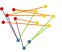
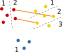

Data model
==========

The vertices of the graph are called **entities**. The edges between the
entities are just called **edges**. The graph is directed, hence each edge
has a source and a destination entity, which are respectively called its **left-**
and **right-hand side** (shortened to **LHS** and **RHS**).

Each entity is of a certain **entity type** (one and only one type per entity).
Thus, the types partition all the entities into disjoint groups. Similarly, each
edge also belongs to exactly one **relation type**. All edges of a given
relation type must have all their left-hand side entities of the same entity
type and, similarly, all their right-hand side entities of the same entity type
(possibly a different entity type than the left-hand side one). This property
means that each relation type has a left-hand side entity type and a right-hand
side entity type.

    In this graph, there are 14 entities: 5 of the red entity type, 6 of the
    yellow entity type and 3 of the blue entity type; there are also 12 edges:
    6 of the orange relation type (between red and yellow entities), 3 of the
    purple entity type (between red and blue entities) and 3 of the green entity
    type (between yellow and blue entities).

In order for torchbiggraph to operate on large-scale graphs, the graph is broken
up into small pieces, on which training can happen in a distributed manner. This
is first achieved by further splitting the entities of each type into a certain
number of subsets, called **partitions**. Then, for each relation type, its
edges are divided into **buckets**: for each pair of partitions (one from the
left- and one from the right-hand side entity types for that relation type)
a bucket is created, which contains the edges of that type whose left- and
right-hand side entities are in those partitions.

    This graph shows a possible partition of the entities, with red having 2
    partitions, yellow having 3, and blue having only one (hence blue is
    unpartitioned). The edges displayed are those of the orange bucket between
    the second red partition and the second yellow partition.

.. note::
    For technical reasons, at the current state all entity types must be divided
    into the same number of partitions (except unpartitioned entities). In
    numpy-speak, it means that the number of partitions of all entities must
    be broadcastable to the same value.

An entity is identified by its type, its partition and its index within the
partition (indices must be contiguous, meaning that if there are :math:`N`
entities in a type's partition, their indices must be between 1 and :math:`N`
inclusive). An edge is identified by its type, its bucket (i.e., the partitions
of its left- and right-hand side entity types) and the indices of its left- and
right-hand side entities in their respective partitions. An edge doesn't have
to specify its left- and right-hand side entity types, because they are implicit
in the edge's relation type.

Input format
============

Entity and relation types
-------------------------

The list of entity types (each identified by a string), plus some information
about each of them, is given in the ``entities`` key of the configuration file.
The list of relation types (each identified by its index in that list), plus
some data like what their left- and right-hand side entity types are, is in the
``relations`` key of the configuration file.

Entities
--------

The only information that needs to be provided about entities is how many there
are in each entity type's partition. This is done by putting, in a certain directory,
a file named :file:`entity_count_{type}_{part}.pt` for each entity type identified
by ``type`` and each partition ``part``. These files must contain a
PyTorch-flavored pickled integer (i.e., the format produced by :func:`torch.save`),
which is the number of entities in that partition. The directory where all these
files reside must be specified as the ``entityPath`` key of the configuration file.

It is possible to provide an initial value for the embeddings, by specifying a
value for the ``loadPath`` configuration key, which is the name of a directory that
contains files in a format similar to the output format detailed in
:ref:`output-format`: the :file:`METADATA_1` file can be omitted, the optimizer
state can be ``None`` and, optionally, one can also omit the :file:`CHECKPOINT_VERSION`
file and avoid adding a version suffix to any file.

.. todo::
    If no initial value is provided, it will be auto-generated, using ``initScale``.

Edges
-----

For each bucket there must be a file that stores all the edges that fall in that
bucket, of all relation types. This means that such a file is only identified by
two integers, the partitions of its left- and right-hand side entities. It must
be named :file:`edges_{lhs}_{rhs}.h5` (where ``lhs`` and ``rhs`` are the above
integers), it must be a `HDF5 <https://www.hdfgroup.org/solutions/hdf5/>`_ file
containing three one-dimensional datasets of the same length, called ``rel``,
``lhs`` and ``rhs``. The elements in the :math:`i`-th positions in each of them
define the :math:`i`-th edge: ``rel`` identifies the relation type (and thus the
left- and right-hand side entity types), ``lhs`` and ``rhs`` given the indices
of the left- and right-hand side entities within their respective partitions.

.. note::
    When using featurized entities this format will be different.

.. note::
    If an entity type is unpartitioned (that is, all its entities belong to the
    same partition), then the edges incident to these entities must still be
    uniformly spread across all buckets.

These files, for all buckets, must be stored in the same directory, which must
be passed as the ``edgePaths`` configuration key. That key can actually contain
a list of paths, each pointing to a directory of the format described above: in
that case the graph will contain the union of all their edges.

Observe that an edge can appear multiple times in the input (either in the same
directory, or in different directories) and that causes it to be counted with
multiplicity. Thus, in fact, the graph is a multigraph. (The graph is also
allowed to contain loops, that is, edges with the same entity on both sides)

.. note::
    When using dynamic relations there also needs to be an additional file,
    named :file:`dynamic_rel_count.pt`, in the ``entityPath`` directory.

.. _output-format:

Output format
=============

The training's checkpoints are also its output, and they are written to the directory
given as the ``outdir`` parameter in the configuration. Checkpoints are identified
by successive positive integers, starting from 1, and all the files belonging to
a certain checkpoint have their names end with :file:`.{version}`.

Each checkpoint contains a metadata file named :file:`METADATA_1.pt`, whose
content is a PyTorch-flavored pickled tuple (as produced by :func:`torch.save`)
with 5 elements: the configuration of the run (serialized as a dictionary), two
integers (encoding the epoch, the edge path index and the edge chunk index), the
state dictionary of the model (minus the entity embeddings) and the state of the
model optimizer. Sifting through the model's state dict is currently the only way
to retrieve the relation operator parameters.

Then, for each entity type and each of its partitions, there is a file
:file:`{type}_{part}.pt` (where ``type`` is the type's name and ``part``
is the 1-based index of the partition), which is again a PyTorch-flavored
pickled tuple, with 2 elements. The first element is the embeddings of the
entities as a two-dimensional PyTorch tensor (possibly wrapped in a
:class:`torch.nn.Parameter`) with the first dimension being the number of
entities and the second being the dimension of the embedding. The second element
is the state of the optimizer for those entities.

An additional file in the same directory, called :file:`CHECKPOINT_VERSION`,
contains the latest checkpoint version, as an ASCII-encoded decimal number.
While the metadata files are never deleted, the embedding files are removed as
soon as a newer version of the checkpoint is fully committed.
